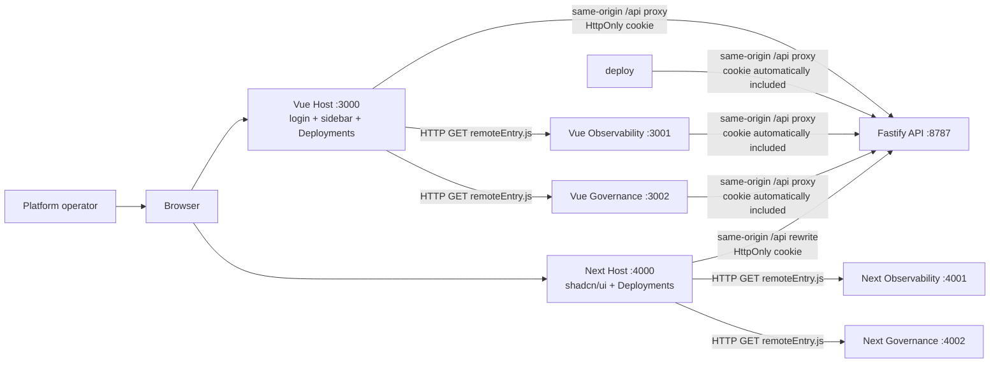
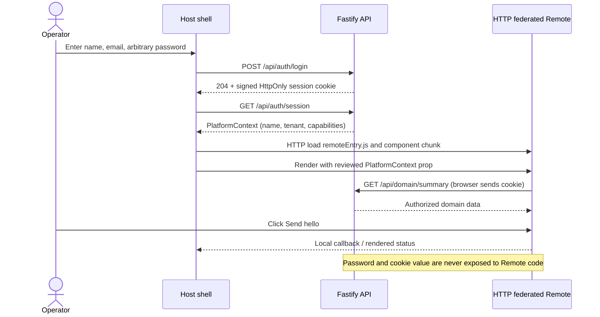

# AI Platform Shell with team-owned Module Federation remotes

## Purpose

This pilot demonstrates two equivalent logged-in AI platform tracks. Deployments is deliberately Host-owned; Observability and Governance are independently deployed HTTP Module Federation Remotes in both Vue and Next.js.

The audience is a platform operator who needs a consistent navigation and identity across deployment, reliability, and governance work. The page's job is to let that operator change domain without losing their signed-in tenant, permissions, or product navigation.

## Scope

Vue uses Vite and `@module-federation/vite`; Next uses webpack's `ModuleFederationPlugin`. The Host owns login, sidebar, routing, and Deployments. Observability and Governance build and deploy independently. Both tracks use the same Fastify API and prove that the boundary is an HTTP-delivered module contract, not an iframe.

## Service architecture



Every Remote entry URL is public HTTP runtime configuration; no Remote is bundled from a local Host import. The allocation is fixed: Vue `3000–3002`, Next `4000–4002`, API `8787`.

## Login and Remote interaction sequence



```text
AI Platform Shell (Host)
├── authenticated session and tenant context
├── product header, persistent sidebar, and top-level routing
├── access control, remote loading, error recovery, and telemetry
└── route outlet
    ├── /deployments/*    Deployments Host view — Platform team
    ├── /observability/*  Observability Remote — SRE team
    └── /governance/*     Governance Remote — Security team
```

Observability and Governance are separate applications, not Host feature folders. Deployments is intentionally a Host feature because it shares the platform's primary control surface.

```text
Browser
├── Vue Platform Shell + federated Remote JavaScript
└── /api/* (same browser origin)
    └── Fastify API
        ├── local demo login and signed session cookie
        ├── /auth/session → minimum PlatformContext
        └── domain APIs → server-side tenant/capability authorization
```

## Explicitly out of scope

- iframe composition and `postMessage` bridges
- non-composed Standalone comparison apps
- a shared cross-application store
- exposing or passing bearer-token strings to Remote code

The removed work remains available through Git history if a comparison becomes necessary later.

## Ownership and contracts

| Concern | Owner | Contract with Remotes |
| --- | --- | --- |
| Login, session renewal, tenant, and authorization | Host / BFF | `PlatformContext` exposes only minimum display and capability data. |
| Sidebar, header, global notifications, route selection | Host | Remotes request navigation or notifications through typed callbacks. |
| Domain UI, local filters, page-level loading/error states | Owning Remote | Remote owns no global navigation or session persistence. |
| Server-side permission enforcement | API / BFF | Every API authorizes the session independently; UI permissions are never the security boundary. |
| Visual primitives | Host/Remote-local shadcn UI primitives plus shared design tokens | No shared Vue or React store package. |

`PlatformContext` is data, not a credential:

```ts
interface PlatformContext {
  user: { id: string; displayName: string };
  tenant: { id: string; name: string };
  capabilities: readonly PlatformCapability[];
}
```

For the pilot, the Host supplies a deterministic mock session. Production uses OIDC through a Host-owned BFF and `Secure`, `HttpOnly` session cookies. A Remote receives neither a refresh token nor an access token. It calls an authorized BFF/API using the browser session, while the server remains the final authorization authority.

## Authentication backend

The pilot needs a small backend because a front-end-only login cannot safely demonstrate shared session or server-side authorization. The backend will be a TypeScript **Fastify** application in `apps/api`.

Fastify is the selected implementation because its in-process `app.inject()` API verifies HTTP routes, cookies, validation, authorization, and error responses without a browser or a database. Its schema-first route model also keeps the public contracts visible in tests. The pilot uses an in-memory user/session repository; a production adapter can replace it without changing the browser contract.

### Demo login flow

1. A user enters a display name, email, and any non-empty password in the Host login form.
2. `POST /api/auth/login` validates the request and creates a short-lived server session for a deterministic demo user/tenant/capability set. The password is never persisted, logged, returned, or passed to a Remote.
3. The API responds with a signed, `HttpOnly`, `SameSite=Lax` session cookie. In HTTPS production it is also `Secure`.
4. The Host calls `GET /api/auth/session`, renders the returned `PlatformContext`, and passes that context to the mounted Remote.
5. A federated Remote uses the same browser session for `fetch('/api/...', { credentials: 'include' })`; it can also receive `PlatformContext` as a typed prop for immediate rendering.
6. Every domain endpoint resolves the session and checks tenant/capability server-side. `POST /api/auth/logout` invalidates the session and clears the cookie.

The browser's same-origin `/api` path is intentional. In development each Vite app proxies `/api` to Fastify; in deployment an ingress serves the Host and API under one origin. This avoids cross-origin cookie and CORS complexity, and lets federated JavaScript retain one session regardless of which Remote is mounted.

### API surface

| Endpoint | Purpose | Response / enforcement |
| --- | --- | --- |
| `POST /api/auth/login` | Establish local demo session | Accepts non-empty name/email/password; emits cookie only. |
| `GET /api/auth/session` | Restore page after refresh; supply Host context | Returns `PlatformContext`, never a password or token. |
| `POST /api/auth/logout` | End session | Invalidates server-side session and clears cookie. |
| `GET /api/deployments/*` | MLOps data | Requires `deployments:read`. |
| `GET /api/observability/*` | SRE data | Requires `observability:read`. |
| `GET /api/governance/*` | Security data | Requires `governance:read`. |

The arbitrary-password rule is only for the local demo. A production OIDC provider verifies credentials; the BFF exchanges the authorization code and retains tokens server-side, preserving the same `GET /api/auth/session` browser contract.

## Routing and lifecycle

The Host owns the browser URL. A sidebar item selects a route prefix, lazily loads that Remote's entry, and mounts its route component in the outlet. The Host provides the current platform context plus a narrow navigation/event API. A Remote may manage nested paths below its assigned prefix, but must report navigation intent to the Host so Back/Forward and deep links stay coherent.

```text
Sidebar click → Host authorizes → Host updates URL → Remote loads/mounts
Remote intent → typed event → Host validates → Host updates URL or global UI
```

Each Remote gets a versioned public interface. Breaking prop/event changes require a new interface version or coordinated Host/Remote release. The Host shows a route-level fallback and retry action when a Remote entry or chunk fails.

## Remote registry

The Host keeps the deployment configuration rather than hard-coding remote URLs across components.

```ts
interface RemoteRegistration {
  id: 'deployments' | 'observability' | 'governance';
  routePrefix: string;
  remoteEntryUrl: string;
  requiredCapabilities: readonly PlatformCapability[];
  load: () => Promise<PlatformRemoteModule>;
}
```

`remoteEntryUrl` is public runtime configuration, not a secret. Secret values remain server-only. Remote assets must be served with explicit CORS rules for the Host origin and immutable, versioned asset URLs.

## Visual direction

The design remains Flight Deck Ledger: a calm, dark operations instrument rather than three disconnected dashboards. The Shell's signature element is a persistent left-side **mission rail**: compact domain markers show the active team's operational signal while the main outlet changes. It encodes real route ownership, rather than being decoration.

- Palette: Orbit `#080B12`, Panel `#111621`, Grid `#222B3A`, Signal `#2DD4BF`, Warning `#F7B84B`, Text `#D9E2F2`.
- Typography: Manrope Variable for product language, JetBrains Mono Variable for tenant, capability, and operational data.
- Layout: fixed sidebar and header on desktop; a compact drawer on mobile; only the outlet scrolls.
- Motion: one short route-transition and loading-state handoff, disabled under reduced motion.

The Vue and Next Hosts implement the same visual and interaction contract: the Flight Deck mission rail, authenticated identity block, route header, Host-owned Deployments view, and per-domain **Send hello** status. Each track uses its framework's local shadcn-compatible primitives; the public design reference is the root [`DESIGN.md`](DESIGN.md).

## Delivery plan

1. Keep Deployments in each Host, including its domain API call and local action.
2. Run Vue Host/Observability/Governance at `3000/3001/3002`.
3. Run Next Host/Observability/Governance at `4000/4001/4002`.
4. Keep HTTP remote entries, typed `PlatformContext`, and server-side capability checks.
5. Validate login, each mounted Remote, Host-owned Deployments, and action logs with screenshots.

## Success criteria

- A signed-in mock user remains visible while moving among all three team routes.
- The Sidebar and URL are Host-owned and persist across Remote changes.
- Each Remote is independently buildable and exposes only its reviewed public module.
- A Remote cannot access a token through its public interface.
- Login, refresh, logout, and denied domain-API access are covered by Fastify injection and browser tests.
- Capability changes hide/deny the appropriate routes in the Host, while server authorization remains required.
- Remote load failures affect only the outlet and recover via Host-owned retry.
