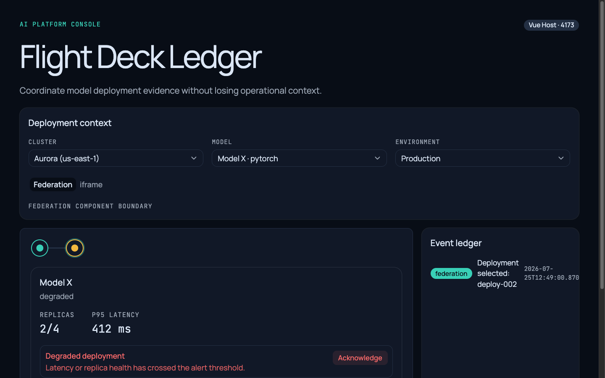
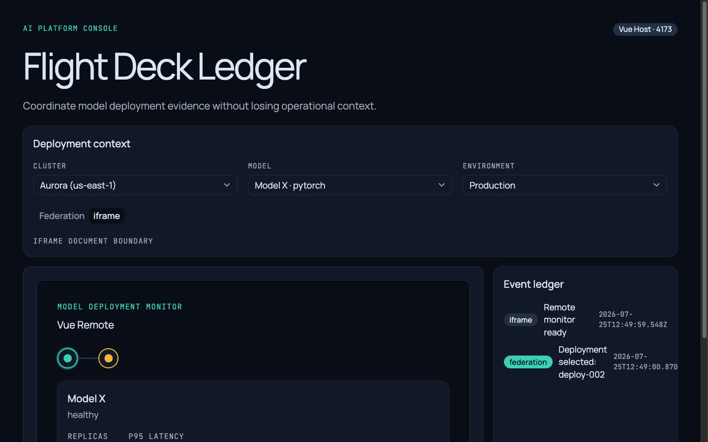
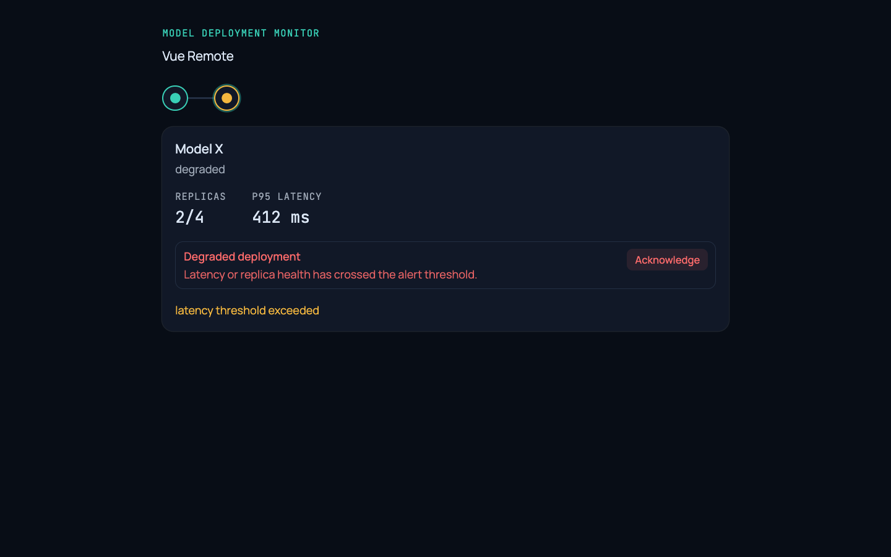
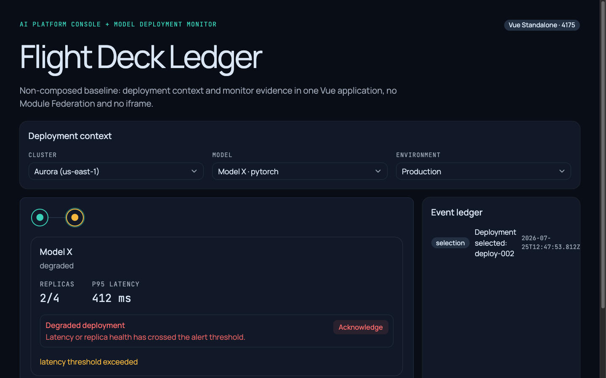
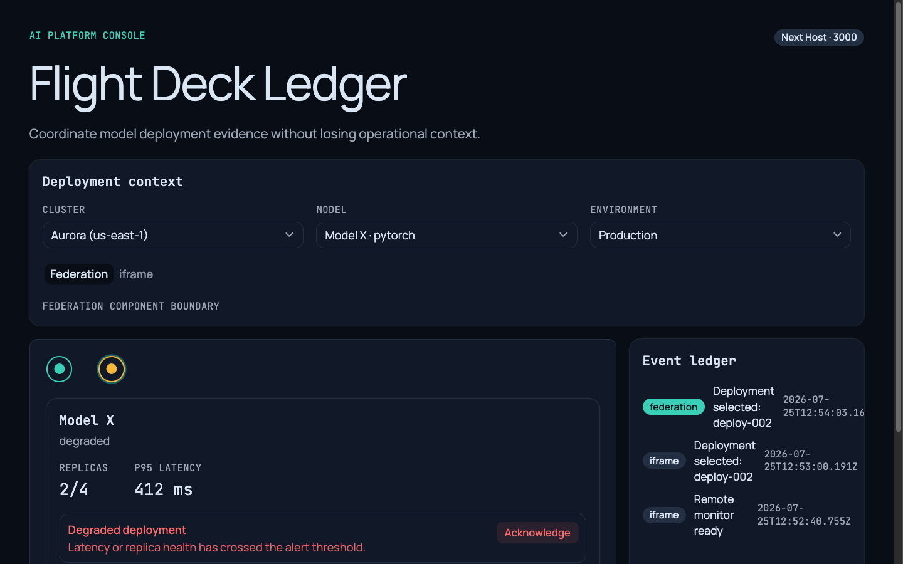
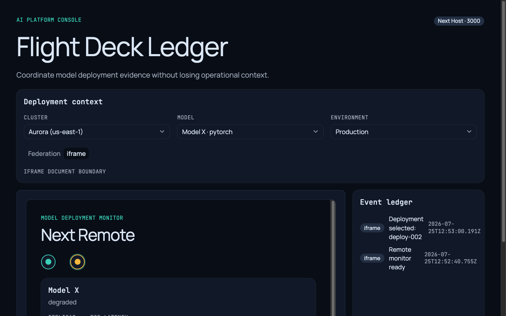
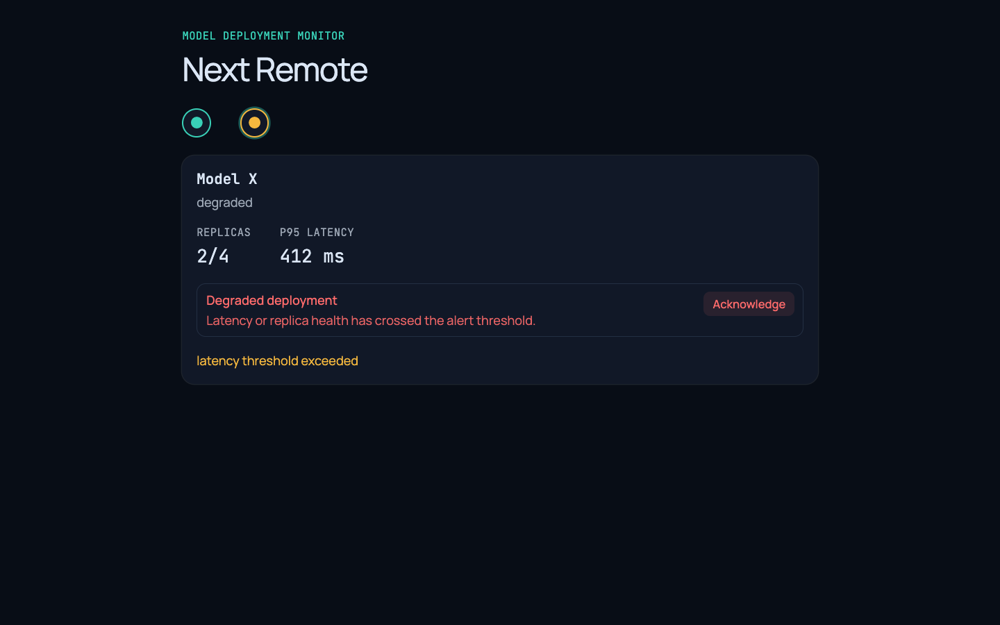
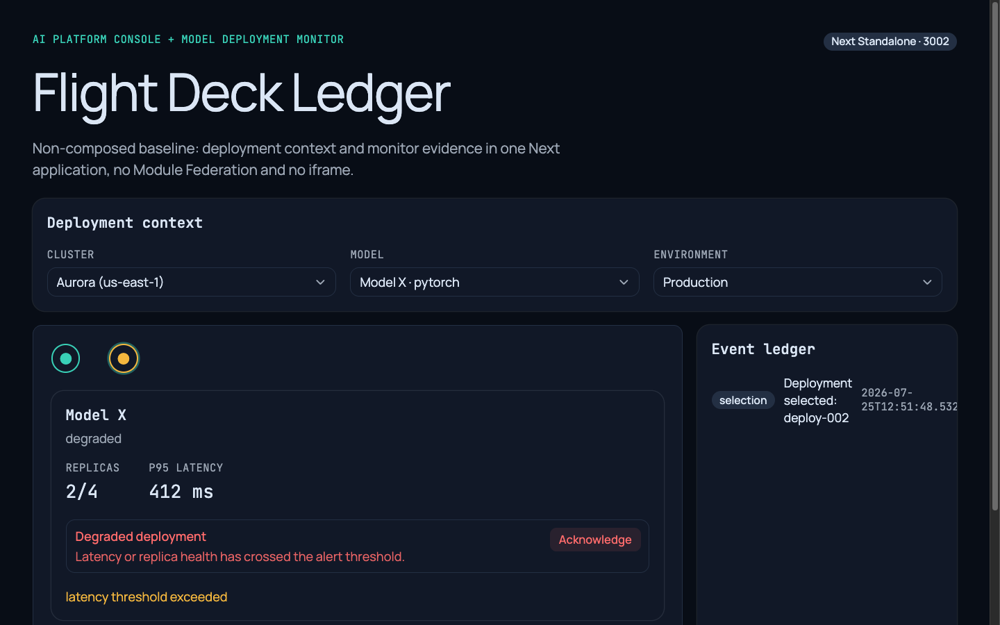

<div align="center">

# jyje/pilot-module-federation

Vue 3와 최신 Next.js를 비교하는 UI-in-UI 마이크로프론트엔드 파일럿.

여섯 개의 독립 실행 가능한 애플리케이션, 하나의 공유 AI 플랫폼 시나리오, 그리고 Module Federation·iframe·비합성(non-composed) 단독 배포를 근거 기반으로 비교합니다.

[](https://github.com/jyje/pilot-module-federation)

[English](README.md) / [한국어](README-ko.md)

</div>

## 현재 상태

`v0.0.1` Draft. pnpm 워크스페이스, 공유 contracts/fixtures/design tokens, 여섯 개 앱 전체, 양쪽 Module Federation 구현, 두 프레임워크의 iframe 합성, 두 프레임워크의 비합성 Standalone baseline까지 모두 구현·검증되었습니다 — 아래 [검증](#검증) 항목을 참고하세요. 오너가 증거를 검토하고 `v0.1.0` 게이트를 승인하기 전까지 버전은 `0.0.1`로 유지됩니다. 원격 푸시는 별도 승인 절차를 따르며, [`TASK.md`](TASK.md)에 기록되어 있습니다.

## 파일럿 시나리오

Host는 **AI Platform Console**이고, Remote는 **Model Deployment Monitor**입니다.

```text
AI Platform Console (Host)
├── cluster, model, environment 컨텍스트
├── 합성 방식 선택기 (Federation / iframe)
└── Model Deployment Monitor (Remote)
    ├── 배포 상태와 replica 정보
    ├── 지연 시간과 이벤트 타임라인
    └── Host로 되돌아가는 의미론적 이벤트
```

각 프레임워크마다 세 가지 형태로 비교하며, 전부 구현되어 있습니다.

1. Module Federation을 통한 Host + Remote 합성.
2. iframe을 통한 Host + Remote 합성.
3. Console과 Monitor를 하나의 비합성 앱에 담은 별도의 Standalone baseline.

Remote는 Host 없이도 단독으로 미리보기 가능한 독립 운영 화면으로 유지됩니다. Standalone 앱은 Remote 미리보기의 별칭이 아니라 의도적으로 분리된 앱입니다 — 이렇게 해야 설정 방식, 런타임 경계, 장애 대응, 개발 경험을 공정하게 비교할 수 있습니다.

## 프레임워크 매트릭스

| 트랙 | Host | Remote | Standalone baseline | UI 컴포넌트 | 합성 대상 |
| --- | --- | --- | --- | --- | --- |
| Vue | Vue 3 | Vue 3 | Vue 3 | shadcn-vue (`reka-nova`) | Federation, iframe, 비합성 standalone |
| Next | Next.js `16.2.11` | Next.js `16.2.11` | Next.js `16.2.11` | shadcn/ui (`radix-nova`) | Federation, iframe, 비합성 standalone |

shadcn/ui는 React 기반이며, Vue 쪽은 동등한 컴포넌트·테마 모델을 갖춘 Vue 포트인 shadcn-vue를 사용합니다. 다만 레지스트리 스타일 이름은 서로 다릅니다(`reka-nova` vs `radix-nova`). 두 트리 모두 동일한 `@pilot/design-tokens` 패키지를 사용하므로, Flight Deck Ledger 팔레트·타이포그래피·`focus-visible` 처리는 프레임워크와 무관하게 픽셀 단위로 동일하게 렌더링됩니다 — 이는 [Playwright MCP QA 패스](docs/validation/playwright-mcp-v0.1.0-ko.md)에서 단순 주장이 아니라 실제 라이브 브라우저로 확인한 사실입니다.

## 최신 Next.js에서의 Module Federation

가장 직관적인 경로인 `@module-federation/nextjs-mf@8.8.71`은 `next@16.2.11`에서 **`INVALIDATED`**(무효) 판정을 받았습니다. 이 패키지가 선언한 peer 범위는 Next 15까지만 지원하며, `next.config.mjs`가 webpack 컴파일이 시작되기도 전에 크래시합니다 — 전체 근거는 [`spikes/next-latest-federation/README-ko.md`](spikes/next-latest-federation/README-ko.md)에 있습니다. 판정을 통과시키려고 Next.js 버전을 낮추는 일은 하지 않았습니다.

이 판정은 특정 래퍼 패키지 하나에 관한 것이지, Next 16에서 Federation 자체가 아예 불가능하다는 뜻은 아닙니다. 후속 조사 결과, `nextjs-mf`와 무관하게 Next가 내부적으로 번들링하는 webpack 5 자체의 내장 `ModuleFederationPlugin`은 실제로 동작한다는 것을 확인했습니다. 다만 Next 특유의 네 가지 문제(청크 로딩 전역명 충돌, 런타임 청크 분리로 인한 정지, 브라우저 캐시가 모든 수정 사항을 가리는 문제, Module Federation이 노출된 컴포넌트 자신의 CSS를 origin 경계 너머로 전달하지 않는 문제)를 각각 우회해야 했습니다. 전체 디버깅 기록은 [`spikes/next-raw-federation/README-ko.md`](spikes/next-raw-federation/README-ko.md)에 있습니다.

`next/host`와 `next/remote`는 이렇게 동작이 확인된 구현을 그대로 탑재하고 있습니다. 실제로 남은 제약은 하나뿐입니다: 노출된 `FederatedMonitor` 컴포넌트는 의도적으로 **상태를 갖지 않습니다(stateless)** — 상호작용 상태는 전부 Host가 소유하고 props로 내려줍니다. 독립적으로 빌드된 두 Next 앱 사이에서 React 싱글톤을 신뢰성 있게 공유하는 문제가 아직 미해결이기 때문입니다([`LOG.md`](LOG.md)의 I-018로 추적 중이며, stateless 경계에서는 애초에 필요하지 않습니다). 이는 버그를 피하기 위한 임시방편이 아니라 정당한 아키텍처 선택입니다 — Host가 합성 상태와 이벤트 원장(event ledger)을 소유하는 이 프로젝트의 다른 모든 지점과 동일한 패턴입니다.

## 합성 방식 비교

- **Module Federation:** 두 프레임워크 모두 구현되었습니다. Vue는 `@module-federation/vite`를 사용하고, Next는 webpack 자체의 `ModuleFederationPlugin`을 직접 사용합니다(위 참고). 두 트랙 모두 동일한 fixture/context 시맨틱을 공유하며, 출처가 태그된(`federation`) 이벤트를 Host의 이벤트 원장에 기록합니다.
- **iframe:** 두 프레임워크 모두 구현되었습니다. 양쪽에서 정확한 origin `postMessage` 계약(origin 검증과 스키마 검증을 모두 수행 — origin 일치만으로는 충분하지 않습니다)과 8초 타임아웃 → 폴백 → 재시도 흐름이 있으며, 네트워크 수준의 장애 시뮬레이션으로 라이브 검증했습니다.
- **Remote 직접 미리보기:** 두 Remote 모두 Host 없이도 독립적으로 실행되고 유용합니다.
- **비합성 Standalone baseline:** 두 프레임워크 모두 동일한 Console + Monitor 시나리오를 런타임 합성 없이 하나의 앱에 구현했습니다. 다른 앱의 소스, Module Federation, iframe, `postMessage`를 import하면 빌드가 실패하도록 아키텍처 가드 테스트로 강제합니다.
- **Web Components:** 이 파일럿에서는 구현하지 않은 프레임워크 중립 대안입니다. Vue와 React 모두 커스텀 엘리먼트로 컴파일할 수 있어, Module Federation과 iframe이 제공하는 네이티브 DOM 합성을 포기하는 대신 더 작고 표준 기반인 런타임과 자체적인 프레임워크 간 상태 공유 방식 부재를 맞바꾸게 됩니다.
- **single-spa:** 독립적으로 배포되는 여러 라우트 "parcel"을 가진 포트폴리오를 위한 오케스트레이션 대안입니다. 이 파일럿의 단일 Host + 단일 Remote 시나리오와는 문제의 형태 자체가 달라, 이런 2-앱 비교보다는 더 큰 규모의 다중 팀·다중 라우트 환경에 적합합니다.

어느 하나가 절대적으로 우월하다고 결론짓지 않습니다. Module Federation은 네이티브 DOM 합성과 공유 의존성 중복 제거를 제공하지만 프레임워크 버전 결합과(오늘 시점 Next 16 기준) 상당한 설정 복잡도라는 비용이 따릅니다. iframe은 강력한 격리와 프레임워크 독립성을 제공하지만 문서 경계와 직접 작성해야 하는 메시지 계약이라는 비용이 따릅니다. 비합성 Standalone은 애초에 런타임 합성을 하지 않음으로써 두 비용을 모두 피합니다 — 어느 쪽이 옳은가는 팀이 실제로 피하고 싶은 비용이 무엇인지에 달려 있습니다.

## 저장소 구조

```text
vue/
├── host/         AI Platform Console (Federation + iframe)
├── remote/       Model Deployment Monitor (직접 미리보기 가능)
└── standalone/   비합성 Console + Monitor baseline
next/
├── host/         AI Platform Console (Federation + iframe)
├── remote/       Model Deployment Monitor (직접 미리보기 가능)
└── standalone/   비합성 Console + Monitor baseline
packages/
├── contracts/       프레임워크 중립 TypeScript 계약
├── fixtures/        결정론적 공유 도메인 fixture
└── design-tokens/   공유 시맨틱 CSS 변수 (Flight Deck Ledger)
spikes/
├── next-latest-federation/   @module-federation/nextjs-mf — INVALIDATED
└── next-raw-federation/      raw webpack.container.ModuleFederationPlugin — 채택됨
e2e/                Playwright Test 스펙
docs/
└── validation/     Playwright MCP 라이브 QA 보고서
artifacts/
└── screenshots/readme/
```

하나의 pnpm 워크스페이스가 lockfile, 스크립트, contracts, fixtures, design tokens를 중앙에서 관리합니다. 어떤 애플리케이션도 다른 애플리케이션의 소스, 라우터, 스토어를 import하지 않으며, 두 Standalone baseline 모두 아키텍처 가드 테스트로 이를 강제합니다.

## 시작하기

```bash
pnpm install
```

```bash
pnpm dev
```

여섯 개 개발 서버를 패키지 접두사 로그와 함께 병렬로 실행합니다: Vue Host `4173`, Vue Remote `4174`, Vue Standalone `4175`, Next Host `3000`, Next Remote `3001`, Next Standalone `3002`.

필터링된 변형:

```bash
pnpm dev:composed      # Host/Remote 네 개 서버만
pnpm dev:standalone    # Standalone baseline 두 개만
pnpm dev:vue           # Vue Host + Remote + Standalone
pnpm dev:next          # Next Host + Remote + Standalone
```

또는 단일 앱을 독립적으로 실행할 수 있습니다. 예:

```bash
pnpm --filter @pilot/next-host dev
```

## 검증

```bash
pnpm lint        # 워크스페이스 전체 ESLint
pnpm typecheck   # 패키지별 tsc / vue-tsc
pnpm test        # Vitest 단위/컴포넌트 테스트 — 237/237
pnpm build       # 9개 패키지 독립 빌드
pnpm e2e         # Playwright Test — 16/16
```

위 명령은 전부 실제로 검사를 수행하는 게이트입니다. `lint`는 존재하지 않을 수도 있는 패키지별 스크립트에 위임하는 대신 ESLint를 직접 실행하며, `test`/`e2e`는 Remote 접속 불가 → 폴백 → 재시도 복구를 포함해 두 프레임워크의 Federation·iframe 경로를 모두 다룹니다.

자동화된 커버리지 외에도, 구조화된 **Microsoft Playwright MCP** 검증 패스가 8개 화면(두 프레임워크 × Remote/Standalone/Host-Federation/Host-iframe) 전부를 실제 브라우저에서 세 가지 화면 크기로 라이브 점검했습니다 — 접근성 트리, 키보드 전용 조작, 콘솔, 네트워크/CORS, 반응형 레이아웃까지. 이 과정에서 자동화된 테스트 스위트로는 발견할 수 없었던 실제 결함 3건을 찾아 수정했습니다: Vue의 `postMessage` `DataCloneError`, Module Federation이 노출된 컴포넌트 자신의 Tailwind CSS를 소리 없이 누락시키는 문제, Vue/Next 반응형 브레이크포인트 불일치입니다. 전체 보고서: [`docs/validation/playwright-mcp-v0.1.0-ko.md`](docs/validation/playwright-mcp-v0.1.0-ko.md).

## 스크린샷

Playwright MCP로 프로덕션 프리뷰에서 캡처했으며, 캡처 시에만 130% 프레젠테이션 줌(`document.documentElement.style.zoom`)을 임시로 적용했습니다 — 애플리케이션 CSS에는 절대 반영하지 않습니다.


▲ Module Federation으로 Remote를 합성한 Vue Host. 저하된 배포 상태 알림과 federation 출처의 이벤트 원장 항목이 보인다.


▲ iframe으로 Remote를 임베드한 Vue Host. 합성 경계 안에 프레임 문서 고유의 헤더가 그대로 보인다.


▲ Host 없이 직접 미리보기 가능한 독립 애플리케이션으로 실행 중인 Vue Remote.


▲ 동일한 Console과 Monitor 시나리오를 federation도 iframe도 없이 하나의 앱으로 합성한 Vue Standalone.


▲ raw webpack Module Federation으로 Remote를 합성한 Next Host. federation 출처와 iframe 출처 이벤트가 이미 원장에 함께 기록되어 있다.


▲ iframe으로 Remote를 임베드한 Next Host. 합성 경계 안에 프레임된 Next Remote 문서가 그대로 보인다.


▲ Host 없이 직접 미리보기 가능한 독립 애플리케이션으로 실행 중인 Next Remote.


▲ 동일한 Console과 Monitor 시나리오를 federation도 iframe도 없이 하나의 앱으로 합성한 Next Standalone.

## 알려진 한계와 보류된 작업

- **Next 16에서 Module Federation을 통한 React 싱글톤 공유는 아직 미해결**입니다(I-018). 현재 채택한 구현은 이 문제를 해결하는 대신, 노출되는 컴포넌트를 상태 없이(stateless) 유지함으로써 우회했습니다. 경계를 넘나드는 context provider처럼 진짜로 React 인스턴스 공유가 필요한 federated 화면이 미래에 생긴다면 이 문제를 다시 다뤄야 합니다.
- **두 파일럿 트랙 모두 라우터가 없으므로**, 브라우저 뒤로/앞으로 가기 동작은 실수로 빠뜨린 것이 아니라 애초에 범위 밖입니다.
- **키보드 흐름은 라이브로 검증**했지만(Playwright MCP), 아직 반복 실행 가능한 Playwright *Test* 스펙으로 작성하지는 않았습니다.
- 여섯 개 앱 전부에 **`favicon.ico`가 없습니다**(모든 곳에서 동일하게 나타나는 사소한 `404`이며, 수정하지 않았습니다).
- shadcn/ui와 shadcn-vue 사이의 바이트 단위 동일 렌더링은 주장하지 않습니다 — 실제로 동일함이 확인된 항목(design tokens, focus-visible, 키보드 시맨틱)은 위 프레임워크 매트릭스를 참고하세요.

## 계획과 작업 목록

- [아키텍처 계획](2026-07-20_114438-pilot-module-federation-ko.md)
- [구현 체크리스트](TASK.md)
- [구현 이력](LOG.md)
- [프로젝트 지침](CLAUDE.md)

## 프로젝트 로컬 스킬

- `frontend-design`: 디자인 방향, 토큰, 타이포그래피, 레이아웃, 시각적 자기비평.
- `centered-readme`: 중앙 정렬된 헤더와 일반적으로 좌측 정렬된 본문.
- `git-commit-helper`: 승인된 gitmoji, 도메인, 커밋·푸시 워크플로.
