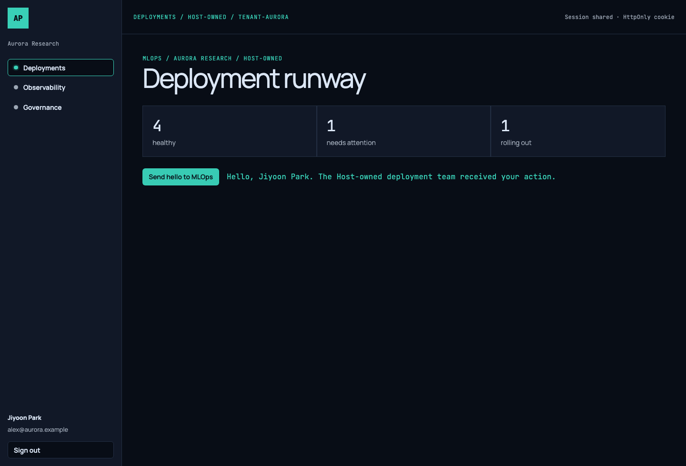
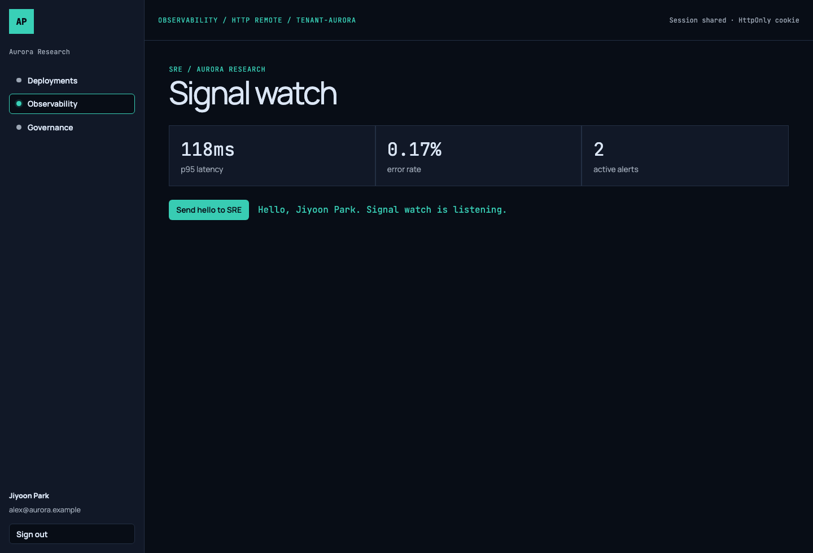
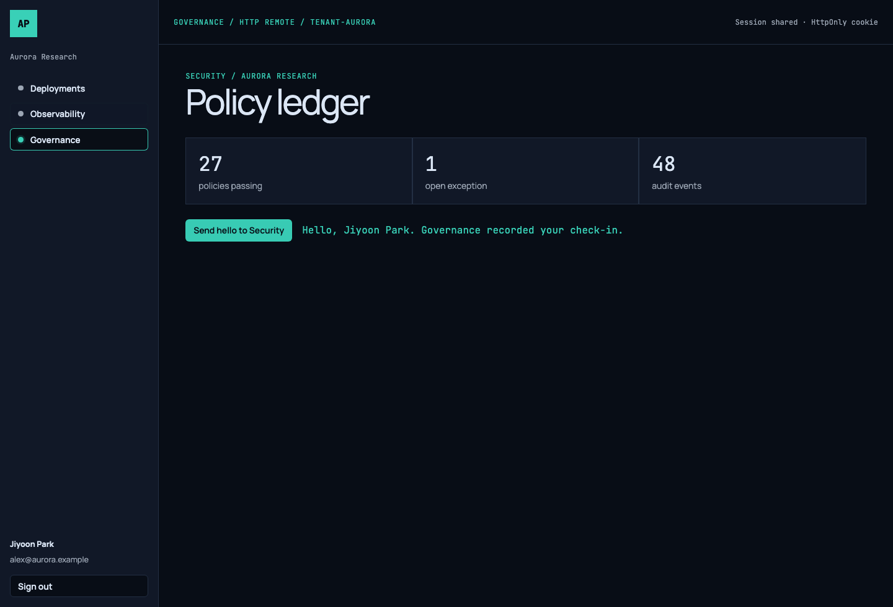
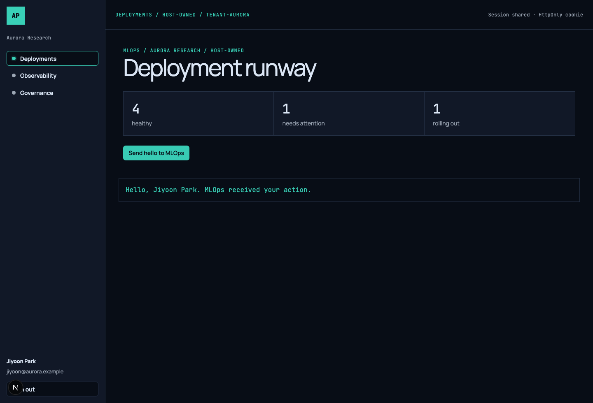
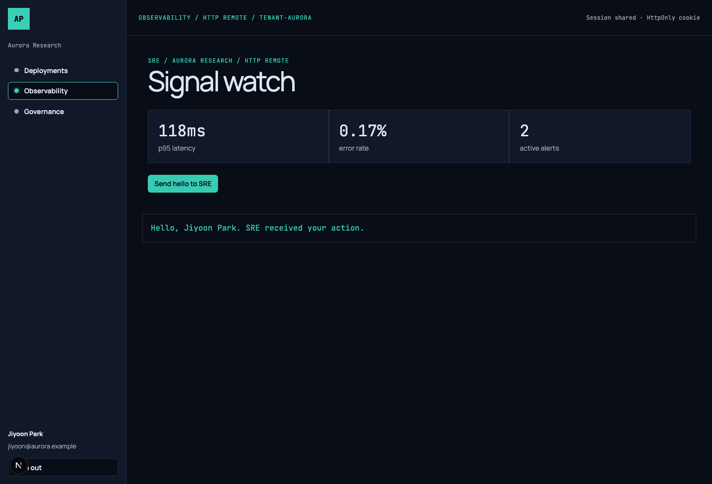
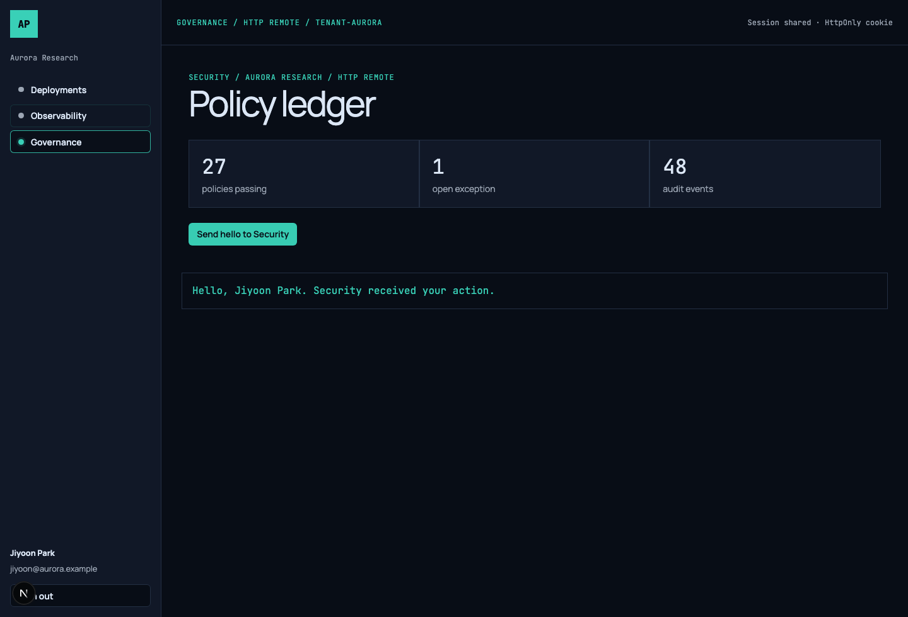

# Platform Shell validation

Validated on 2026-07-27 with Playwright Chromium against Fastify, Vue `3000–3002`, and Next `4000–4002`. Both Host screenshots use the shared mission-rail shell and the framework-neutral [`platform.css`](../../packages/design-tokens/src/platform.css) contract.

## Scenario

1. Open the unauthenticated Vue Platform Shell at `http://127.0.0.1:3000`.
2. Sign in as `Jiyoon Park` / `alex@aurora.example` with a non-empty local-demo password.
3. Select Deployments, Observability, and Governance from the Host-owned mission rail.
4. Require each domain view to render and call its own same-origin, cookie-authenticated API endpoint where applicable.
5. Trigger each team's hello action and capture its visible success status.

The password, signed session-cookie value, and any token are intentionally absent from screenshots and logs.

## Screenshots



▲ Deployments Host view: MLOps shares the global control surface and is not a Remote deployment unit.



▲ Vue Observability Remote: changing teams replaces only the outlet; the SRE action confirms that the shared session context is retained.



▲ Vue Governance Remote: the Security action records a visible check-in using the same tenant and capability context.



▲ Next Host Deployments view: this Host-owned surface has the same shell implementation and behavior as Vue.



▲ Next Observability Remote: only the outlet changes; the SRE action confirms the Host retains navigation, identity, and session context.



▲ Next Governance Remote: the Security action confirms remote interaction while the Host retains the shell.

## Browser console evidence

The following browser `console.info` records were captured by [`scripts/validate-platform.mjs`](../../scripts/validate-platform.mjs). They show a safe `PlatformContext` projection only: user ID, tenant ID, and capabilities.

```text
[platform-shell] session-established {userId: user-operator, tenantId: tenant-aurora, capabilities: deployments:read,observability:read,governance:read}
[vue-deployments-host] operator-action {tenantId: tenant-aurora, action: greet}
[platform-shell] remote-mounted {route: observability, tenantId: tenant-aurora}
[observability-remote] platform-context-received {userId: user-operator, tenantId: tenant-aurora, capabilities: deployments:read,observability:read,governance:read}
[observability-remote] session-api-authorized {tenantId: tenant-aurora}
[observability-remote] operator-action {tenantId: tenant-aurora, action: greet}
[platform-shell] remote-mounted {route: governance, tenantId: tenant-aurora}
[governance-remote] platform-context-received {userId: user-operator, tenantId: tenant-aurora, capabilities: deployments:read,observability:read,governance:read}
[governance-remote] session-api-authorized {tenantId: tenant-aurora}
[governance-remote] operator-action {tenantId: tenant-aurora, action: greet}
```

This verifies the Host/Remote contract:

- The Host retains Deployments and passes the reviewed `PlatformContext` into each independent Remote component.
- Each Remote can use the same browser session through `/api/*` without receiving a password, bearer token, refresh token, or session token.
- Each Remote's local **Send hello** control reacts inside the federation boundary and records a safe domain action.

## Network evidence

| Response | Meaning |
| --- | --- |
| `401 /api/auth/session` | Expected before login; no session is present. |
| `204 /api/auth/login` | Fastify accepted the local demo login and set the signed HttpOnly cookie. |
| `200 /api/auth/session` | The Host restored the minimum platform context from that cookie. |
| `200 /api/deployments/summary` | The Host-owned MLOps surface used the shared session successfully. |
| `200 /api/observability/summary` | SRE Remote used the shared session successfully. |
| `200 /api/governance/summary` | Security Remote used the shared session successfully. |

The raw machine-readable capture is [`browser-log.json`](../../artifacts/validation/browser-log.json).

## Next.js HTTP federation evidence

[`scripts/validate-next-platform.mjs`](../../scripts/validate-next-platform.mjs) loads `http://127.0.0.1:4000`, authenticates `Jiyoon Park`, and loads the Observability and Governance Remote entries from ports `4001` and `4002`.

```text
[next-platform-shell] session-established {userId: user-operator, tenantId: tenant-aurora}
[next-platform-shell] operator-action {tenantId: tenant-aurora, team: MLOps}
[next-observability-remote] platform-context-received {userId: user-operator, tenantId: tenant-aurora}
[next-platform-shell] operator-action {tenantId: tenant-aurora, team: SRE}
[next-governance-remote] platform-context-received {userId: user-operator, tenantId: tenant-aurora}
[next-platform-shell] operator-action {tenantId: tenant-aurora, team: Security}
```

| Response | Meaning |
| --- | --- |
| `401 /api/auth/session` | Expected before login. |
| `204 /api/auth/login` | Fastify set the signed HttpOnly cookie. |
| `200 /api/auth/session` | Next Host restored the safe session context. |
| `200 /api/deployments/summary` | Next Host's MLOps surface used the shared session. |
| `200 /api/observability/summary` | Next Host supplied authorized SRE summary data to the HTTP Remote. |
| `200 /api/governance/summary` | Next Host supplied authorized Security summary data to the HTTP Remote. |

The raw capture is [`next-browser-log.json`](../../artifacts/validation/next-browser-log.json).

## CSS parity evidence

The six visible Vue and Next surfaces import the same semantic Flight Deck
contract from `@pilot/design-tokens/platform.css`. `pnpm validate:css-parity`
loads both Hosts and asserts that Login, the active mission-rail control,
Sign out, and all three domain action buttons have identical computed styles
across frameworks. The raw capture is
[`css-parity.json`](../../artifacts/validation/css-parity.json).

| Element | Shared computed value |
| --- | --- |
| Metric surface | `rgb(17, 24, 39)` (`--platform-surface`) with `20px` padding |
| Product text | Manrope Variable, `rgb(219, 230, 245)` |
| Utility label | JetBrains Mono Variable, `rgb(57, 208, 183)` |
| Primary action | `36px` height, `0 12px` padding, `6px` radius, `rgb(57, 208, 183)` background |
| Button chrome | `1px` token border, `6px` radius, Manrope Variable `14px` / `600` |

Governance uses the same accent as every other platform surface; warning yellow
remains available only as a semantic status token, not as a team theme. The
Next Host also resolves `/observability` and `/governance` through its
Host-owned dynamic route, preserving the Shell on a direct load.
